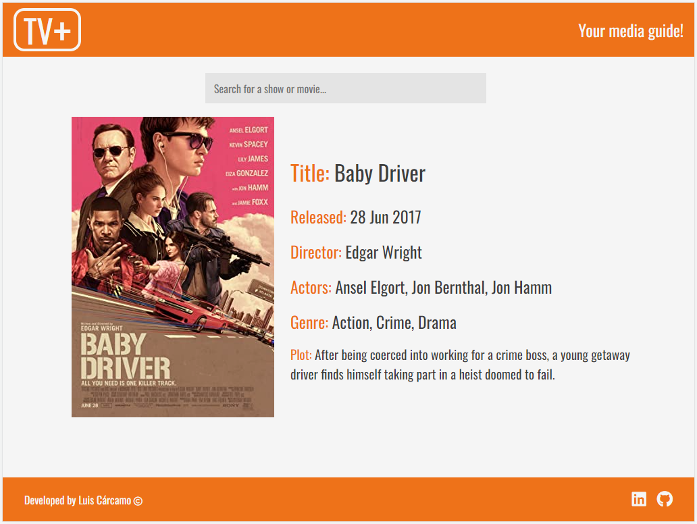

# TV+


## Introduction
**TV+** is a SPA developed to search for information about movies, tv shows, videogames or music videos. It's responsive design allows you to use it on large screens, tablets and mobile devices.

The latest version was deployed using *Heroku*'s server. Feel free use it and let me know what you think! [Link](https://tv-plus.herokuapp.com/)!

## Tech Stack
<div style="display: inline_block"><br>
  
  
  
  
  
  
</div>
<br/>

- HTML
- CSS
- JavaScript
- NodeJS
- Express
- Heroku

Obs. Even though the html file was saved as an .ejs file, the file extension was not actually used other than for the need to set a template engine for NodeJS and Express. For this reason, it was replaced by HTML on the Tech Stack.

## How to Run It
1. Clone the project
```
git clone <url>
```
2. Install the dependencies
```
npm install
```
3. Run the start script on the terminal
```
npm start
```
4. Access localhost on port 3000 with your browser
```
http://localhost:3000/
```



## Credits
TV+'s development was made possible by the **OMDb API** [link](https://www.omdbapi.com/) and inspired by **GeekProbin**'s video *Movie Search App Using OMDb API | Vanilla JavaScript Project*. You can find their excellent video over [here](https://youtu.be/1VjdxCTBfUI).